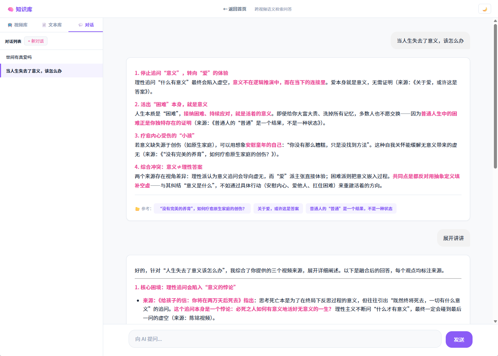
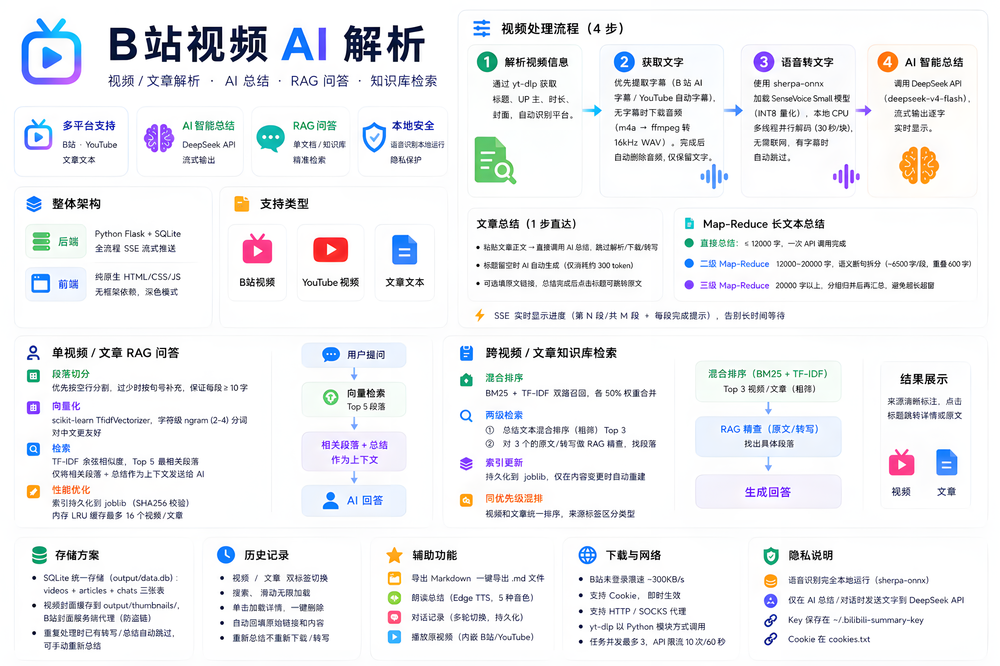

# B站视频总结工具

本地运行的 B站/YouTube 视频 AI 总结工具，同时支持文章总结。全流程自动化：解析 → 字幕/音频 → 语音转文字 → AI 总结 → 知识库问答。

## 界面预览

<p align="center"></p>
<p align="center"><strong>首页</strong></p>
<p align="center"></p>
<p align="center"><strong>知识库问答</strong></p>
<p align="center"></p>
<p align="center"><strong>技术说明</strong></p>

## 环境要求

- Python 3.10 及以上版本
- FFmpeg（音频格式转换）
- 网络连接（首次需下载 SenseVoice Small 模型 ~229MB）

## 一键部署

以下命令按顺序执行即可完成部署：

```bash
# 1. 克隆项目
git clone https://github.com/splexuan/bilibili-summary.git
cd bilibili-summary

# 2. 创建虚拟环境
python -m venv .venv

# 3. 激活虚拟环境
#    Windows:
.venv\Scripts\activate
#    macOS / Linux:
source .venv/bin/activate

# 4. 安装依赖
pip install -r requirements.txt -i https://pypi.tuna.tsinghua.edu.cn/simple

# 5. 下载 FFmpeg（二选一）
#    方式A：蓝奏云下载 ffmpeg.exe 放入 tools/ 目录
#    方式B：启动后在左侧卡片点击"下载 FFmpeg"

# 6. 启动服务
python -B app.py
```

浏览器访问 http://localhost:3195

### 各步骤说明

#### 步骤 1-3：环境准备

克隆项目后创建虚拟环境 `.venv`，激活后终端提示符会带 `(.venv)` 标识。

#### 步骤 4：安装依赖

使用清华镜像加速安装所有 Python 依赖包：

```bash
pip install -r requirements.txt -i https://pypi.tuna.tsinghua.edu.cn/simple
```

#### 步骤 5：下载 FFmpeg

FFmpeg 用于音频格式转换，获取方式：

- **在线下载**：启动后在首页左侧卡片点击"下载 FFmpeg"，自动下载解压到 `tools/`
- **手动下载**：[蓝奏云](https://wwawt.lanzout.com/iim2d3qye27c)（密码 hxaz），将 `ffmpeg.exe` 放入项目 `tools/` 目录

#### 步骤 6：启动服务

- **Windows**：双击 `启动.bat`，自动使用 `.venv` 虚拟环境
- **所有平台**：确认虚拟环境已激活后执行 `python -B app.py`

浏览器访问 http://localhost:3195 打开 Web 界面。

#### 语音模型

SenseVoice Small 语音识别模型（~229MB）在首次使用语音转写时提示下载，也可在首页左侧卡片点击"下载语音模型"提前下载。

### 配置 API Key

在 Web 界面 ⚙ 设置中填写 [DeepSeek API Key](https://platform.deepseek.com/api_keys)，保存至 `~/.bilibili-summary-key`，一次配置永久生效。

可选配置：
- **代理**：HTTP/SOCKS 代理，用于 YouTube 访问

必填配置：
- **B站 Cookie**：B站下载视频必须提供，在设置页粘贴浏览器 Cookie 即可

## 功能

**视频总结**
- 输入 B站/YouTube 链接，自动解析视频信息
- 优先提取字幕（B站 AI 字幕 / YouTube 自动字幕），无字幕时下载音频本地转写
- DeepSeek AI 流式生成结构化 Markdown 总结
- 超长视频自动 Map-Reduce 分段总结再汇总

**文章总结**
- 粘贴正文直接 AI 总结，跳过解析/下载/转写步骤
- 标题留空自动提取，可选填原文链接

**RAG 智能问答**
- 基于视频/文章内容的语义检索问答
- TF-IDF 字符级 ngram 向量化 + 余弦相似度检索
- 仅将相关段落发送 AI，Token 消耗恒定
- 索引持久化 joblib（SHA256 校验），重启不丢失

**跨内容知识库**
- 对所有已总结的视频和文章统一建索引
- BM25 + TF-IDF 混合检索，两级召回（总结粗筛 → 原文精查）
- 支持全局问答，来源标签可追踪

**其他**
- 流式输出：全程 SSE 实时推送进度和文字
- 朗读总结：Edge TTS 语音合成，5 种音色
- 导出 Markdown：一键下载 .md 文件
- 深色模式：自动记忆偏好
- 播放原视频：B站/YouTube 内嵌播放器
- 对话记录：视频内对话和知识库对话均持久化

## 技术栈

| 层级 | 方案 |
|---|---|
| 框架 | Flask + 原生 HTML/CSS/JS |
| 存储 | SQLite（videos + articles + chats） |
| 视频解析 | yt-dlp |
| 语音识别 | sherpa-onnx SenseVoice Small（本地 CPU） |
| AI | DeepSeek API (deepseek-v4-flash) |
| RAG | scikit-learn TF-IDF + 余弦相似度 |
| 知识库 | BM25 + TF-IDF 混合（rank-bm25） |
| TTS | Microsoft Edge TTS |

## 项目结构

```
bilibili-summary/
├── app.py               # Flask 主程序 + API
├── downloader.py        # 视频下载 / 字幕提取
├── transcriber.py       # 语音转文字
├── summarizer.py        # AI 总结 + RAG 引擎
├── kb_index.py          # 知识库混合索引
├── db.py                # SQLite 数据库
├── static/
│   ├── index.html       # 首页（视频/文章）
│   └── knowledge.html   # 知识库问答
├── models/              # 语音识别模型
├── output/              # 数据持久化（SQLite、封面）
├── tools/               # FFmpeg
├── requirements.txt
└── 启动.bat             # Windows 一键启动
```

## 处理流程

```
视频：链接 → yt-dlp 解析 → 字幕提取/音频下载 → 本地转写 → AI 总结 → 知识库
文章：粘贴文本 ────────────────────────────────────── → AI 总结 → 知识库

问答：用户提问 → 总结粗筛（BM25+TF-IDF） → Top3 原文 RAG 精查 → AI 回答
```

## License

MIT
